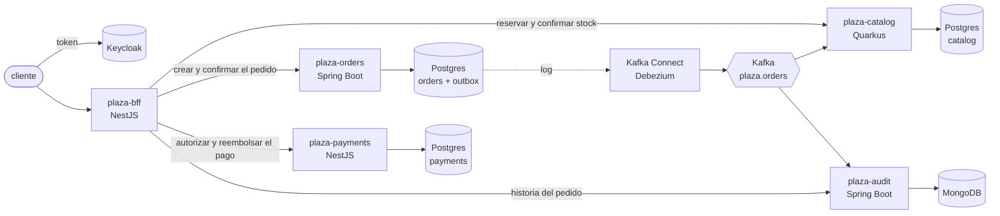

# Plaza

**Plaza es una plataforma de compras construida sobre [Nova](https://github.com/ahincho/nova-shared-01-docs)**,
con un servicio en cada framework que Nova soporta: NestJS, Spring Boot y Quarkus. Existe para
mostrar en un sistema de verdad lo que la plataforma promete: que los tres stacks se ven y se
comportan igual, que una compra deja una sola traza aunque cruce tres frameworks, y que cada
capacidad de Nova tiene un consumidor real.

La decisión está en [ADR-043](https://github.com/ahincho/nova-shared-01-docs/blob/main/adrs/shared/ADR-043-plaza-la-plataforma-de-compras.md).

## Los servicios

| Servicio | Framework | Repositorio | Es dueño de | Puerto local |
|---|---|---|---|---|
| `plaza-bff` | NestJS | `nova-plaza-02-nestjs-bff` | la experiencia del cliente y la compra | 8080 |
| `plaza-orders` | Spring Boot | `nova-plaza-03-spring-boot-orders` | los pedidos, su estado y sus eventos | 8081 |
| `plaza-catalog` | Quarkus | `nova-plaza-04-quarkus-catalog` | los productos, los precios, el stock y el ranking | 8082 |
| `plaza-payments` | NestJS | `nova-plaza-05-nestjs-payments` | la autorización y el reembolso de un pago, simulados | 8083 |
| `plaza-audit` | Spring Boot | `nova-plaza-06-spring-boot-audit` | la historia de cada pedido, en MongoDB | 8085 |

Este repositorio es la entrada al producto: la descripción, el compose que levanta lo que los
servicios necesitan y el guion de la demo. El puerto 3000 queda libre para Grafana.



## La compra

El BFF orquesta la compra y es el único que habla con los servicios; los servicios no se llaman
entre sí.

1. Reserva el stock en el catálogo, que devuelve los precios del momento.
2. Crea el pedido, en estado `PENDING`, con esos precios.
3. Autoriza el pago del total del pedido.
4. Confirma la reserva.
5. Confirma el pedido.

Si un paso falla, el BFF deshace los anteriores: reembolsa el pago, cancela el pedido y libera la
reserva. Nada se reintenta, y una compensación que se pierde no bloquea stock, porque la reserva vence
sola a los diez minutos. La compra lleva un `Idempotency-Key`, así que el cliente puede repetirla sin
comprar dos veces.

## Los eventos

Cada cambio de un pedido -creado, confirmado o cancelado- escribe su evento en la tabla `outbox` de
pedidos, **en la misma transacción** que el cambio. Debezium lo lee del log de PostgreSQL y lo publica
en `plaza.orders` como un CloudEvent, con el id del pedido como clave. Así el pedido y su evento se
guardan juntos o no se guarda ninguno, y una caída de Kafka retrasa el evento en lugar de perderlo
([ADR-048](https://github.com/ahincho/nova-shared-01-docs/blob/main/adrs/shared/ADR-048-outbox-transaccional-detras-de-un-contrato.md)).

| Consumidor | Qué hace con los eventos |
|---|---|
| el catálogo | suma las unidades de cada pedido confirmado al ranking de lo más vendido |
| la auditoría | guarda los tres tipos, y responde la historia de un pedido |

Un evento llega al menos una vez, así que los dos deduplican: el catálogo con el inbox de Nova, en la
transacción que suma, y la auditoría con el id del evento como clave del documento. La traza viaja en
el evento, así que Grafana muestra una sola traza del BFF a pedidos y de ahí al catálogo y a la
auditoría.

## Levantarlo en local

Requiere Docker con Compose.

```bash
docker compose up -d --wait
```

| Qué | Dónde |
|---|---|
| Postgres de pedidos, catálogo y pagos | `localhost:5433`, `5434` y `5435` |
| MongoDB de la auditoría | `localhost:27017` |
| Kafka | `localhost:9092` |
| Kafka Connect con el conector `orders-outbox` | `http://localhost:8084` |
| Keycloak | `http://localhost:8180` |
| Vault en modo dev | `http://localhost:8200` |

Vault arranca con un secreto por servicio ya cargado:

| Secreto en Vault | Claves |
|---|---|
| `secret/plaza/orders/db` | `DB_URL`, `DB_USERNAME`, `DB_PASSWORD` |
| `secret/plaza/catalog/db` | `DB_URL`, `DB_USERNAME`, `DB_PASSWORD` |
| `secret/plaza/payments/db` | `DB_URL`, `DB_USERNAME`, `DB_PASSWORD` |
| `secret/plaza/audit/mongo` | `MONGODB_URI` |

El token de Vault está en `.env.example`. Los valores son solo para esta máquina; para cambiarlos se
copia `.env.example` a `.env`.

### Iniciar sesión

Keycloak importa el realm `plaza` al arrancar, con el cliente público de la demo, `plaza-demo`, y dos
clientes de prueba:

| Usuario | Contraseña | Para qué |
|---|---|---|
| `ana` | `ana-local` | la compra de la demo |
| `luis` | `luis-local` | mostrar que un cliente no ve los pedidos de otro |

La consola de administración está en `http://localhost:8180/admin`, con `admin` y la contraseña de
`.env.example`.

### Los servicios

Cada servicio corre en la máquina, con su propio comando, desde su repositorio. Las dependencias de Nova
están en GitHub Packages, así que Gradle y pnpm necesitan un token con `read:packages`.

```bash
export VAULT_ADDR=http://localhost:8200 VAULT_TOKEN=plaza-local-root
```

| Servicio | Comando |
|---|---|
| pedidos | `./gradlew bootRun` |
| catálogo | `./gradlew quarkusDev` |
| pagos | `NOVA_SECRETS_IMPORT=vault:plaza/payments/db pnpm start:dev` |
| auditoría | `./gradlew bootRun` |
| BFF | `pnpm start:dev`, con las URL de `.env.example` del BFF |

Las trazas, los logs y las métricas van al stack de observabilidad de
[`nova-shared-03-infrastructure`](https://github.com/ahincho/nova-shared-03-infrastructure), que se
levanta aparte.

Para bajarlo todo:

```bash
docker compose down -v
```

## La demo, en diez minutos

Con el compose, los cinco servicios y la observabilidad arriba. Cada paso dice qué capacidad de Nova
se ve.

**1. Iniciar sesión** (Keycloak y el BFF, ADR-043).

```bash
TOKEN=$(curl -s -d grant_type=password -d client_id=plaza-demo -d username=ana -d password=ana-local \
  http://localhost:8180/realms/plaza/protocol/openid-connect/token | jq -r .access_token)
```

**2. Mirar el catálogo**, sin token, con la paginación por cursor (ADR-054).

```bash
curl -s "http://localhost:8080/v1/products?limit=5" | jq
```

**3. Comprar**: la saga cruza Quarkus, Spring Boot y NestJS, y cada respuesta llega en el mismo sobre
(ADR-031).

```bash
curl -s -X POST http://localhost:8080/v1/purchases -H "Authorization: Bearer $TOKEN" \
  -H "Idempotency-Key: demo-001" -H "Content-Type: application/json" \
  -d '{"items":[{"sku":"MUG-001","quantity":2},{"sku":"TEE-002","quantity":1}]}' | jq
```

**4. Repetir la misma compra**: devuelve el mismo pedido, sin cobrar ni reservar de nuevo (ADR-047).

**5. Sin stock**: `HOOD-008` tiene tres unidades. El 409 del catálogo llega con su forma, y nada queda
a medias.

```bash
curl -s -X POST http://localhost:8080/v1/purchases -H "Authorization: Bearer $TOKEN" \
  -H "Idempotency-Key: demo-002" -H "Content-Type: application/json" \
  -d '{"items":[{"sku":"HOOD-008","quantity":5}]}' | jq
```

**6. Un pago rechazado**: doce lámparas pasan el tope de 1000, y el BFF cancela el pedido y libera la reserva.

```bash
curl -s -X POST http://localhost:8080/v1/purchases -H "Authorization: Bearer $TOKEN" \
  -H "Idempotency-Key: demo-003" -H "Content-Type: application/json" \
  -d '{"items":[{"sku":"LAMP-009","quantity":12}]}' | jq
```

**7. Los eventos en Kafka**: los del pedido confirmado y los del cancelado, con las cabeceras de
CloudEvents y el `traceparent` (ADR-048).

```bash
docker compose exec kafka /opt/kafka/bin/kafka-console-consumer.sh --bootstrap-server localhost:9092 \
  --topic plaza.orders --from-beginning --timeout-ms 5000 \
  --formatter-property print.key=true --formatter-property print.headers=true
```

**8. Lo más vendido**, que el catálogo sumó con el evento de la compra del paso 3.

```bash
curl -s http://localhost:8080/v1/products/best-sellers | jq
```

**9. La historia del pedido**, de la auditoría en MongoDB. Con el token de `luis`, el mismo pedido es un
404.

```bash
ORDER=<el id del pedido del paso 3>
curl -s http://localhost:8080/v1/orders/$ORDER/history -H "Authorization: Bearer $TOKEN" | jq
```

**10. Una sola traza** en Grafana (`http://localhost:3000`, Explore, Tempo): el `traceparent` del evento
confirmado lleva a la traza de la compra, del BFF a pedidos, al catálogo y a la auditoría (ADR-032).

## Estado

| Fase | Contenido | Estado |
|---|---|---|
| 1 | este repositorio, los pedidos (Spring Boot), el catálogo (Quarkus) y los pagos (NestJS), con sus secretos en Vault ([ADR-056](https://github.com/ahincho/nova-shared-01-docs/blob/main/adrs/shared/ADR-056-plaza-fase-1-catalogo-y-pagos-en-nestjs.md)) | hecha |
| 2 | el BFF, Keycloak y la compra orquestada, con sus compensaciones | hecha |
| 3 | los eventos con outbox y Debezium, el ranking de lo más vendido y la auditoría en MongoDB ([ADR-048](https://github.com/ahincho/nova-shared-01-docs/blob/main/adrs/shared/ADR-048-outbox-transaccional-detras-de-un-contrato.md)) | hecha |
| 4 | CQRS en los pedidos ([ADR-053](https://github.com/ahincho/nova-shared-01-docs/blob/main/adrs/shared/ADR-053-cqrs-con-command-bus-y-query-bus.md)), adelantada | hecha |
| 5 | un servicio nuevo generado desde el arquetipo | pendiente |

## Licencia

[Eclipse Public License 2.0](LICENSE).
