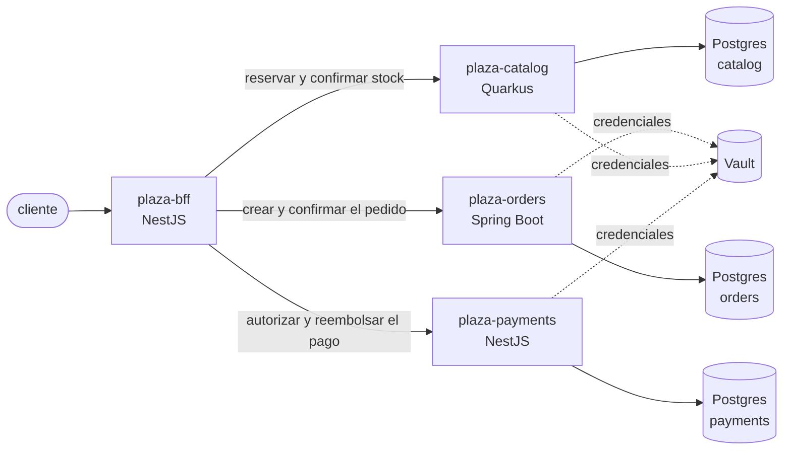

# Plaza

**Plaza es una plataforma de compras construida sobre [Nova](https://github.com/ahincho/nova-shared-01-docs)**,
con un servicio en cada framework que Nova soporta: NestJS, Spring Boot y Quarkus. Existe para
mostrar en un sistema de verdad lo que la plataforma promete: que los tres stacks se ven y se
comportan igual, que una compra deja una sola traza aunque cruce tres frameworks, y que cada
capacidad de Nova tiene un consumidor real.

La decisión está en [ADR-043](https://github.com/ahincho/nova-shared-01-docs/blob/main/adrs/shared/ADR-043-plaza-la-plataforma-de-compras.md).

## Los servicios

| Servicio | Framework | Repositorio | Es dueño de | Puerto local |
|---|---|---|---|---|
| `plaza-bff` | NestJS | `nova-plaza-02-nestjs-bff` | la experiencia del cliente y la compra | 8080 |
| `plaza-orders` | Spring Boot | `nova-plaza-03-spring-boot-orders` | los pedidos y su estado | 8081 |
| `plaza-catalog` | Quarkus | `nova-plaza-04-quarkus-catalog` | los productos, los precios y el stock | 8082 |
| `plaza-payments` | NestJS | `nova-plaza-05-nestjs-payments` | la autorización y el reembolso de un pago, simulados | 8083 |

Este repositorio es la entrada al producto: la descripción, el compose que levanta lo que los
servicios necesitan y el guion de la demo. El puerto 3000 queda libre para Grafana.



## La compra

El BFF orquesta la compra y es el único que habla con los tres servicios; los servicios no se llaman
entre sí.

1. Reserva el stock en el catálogo, que devuelve los precios del momento.
2. Crea el pedido, en estado `PENDING`, con esos precios.
3. Autoriza el pago del total del pedido.
4. Confirma la reserva.
5. Confirma el pedido.

Si un paso falla, el BFF deshace los anteriores: reembolsa el pago, cancela el pedido y libera la
reserva. Nada se
reintenta, y una compensación que se pierde no bloquea stock, porque la reserva vence sola a los
diez minutos. La compra lleva un `Idempotency-Key`, así que el cliente puede repetirla sin comprar
dos veces.

## Levantarlo en local

Requiere Docker con Compose.

```bash
docker compose up -d --wait
```

Levanta una base Postgres por servicio con datos, en los puertos 5433, 5434 y 5435, Keycloak y Vault en modo
dev, con un secreto por servicio ya cargado:

| Secreto en Vault | Claves |
|---|---|
| `secret/plaza/orders/db` | `DB_URL`, `DB_USERNAME`, `DB_PASSWORD` |
| `secret/plaza/catalog/db` | `DB_URL`, `DB_USERNAME`, `DB_PASSWORD` |
| `secret/plaza/payments/db` | `DB_URL`, `DB_USERNAME`, `DB_PASSWORD` |

Vault escucha en `http://localhost:8200`, y su token está en `.env.example`. Los valores son solo
para esta máquina; para cambiarlos se copia `.env.example` a `.env`.

### Iniciar sesión

Keycloak escucha en `http://localhost:8180` e importa el realm `plaza` al arrancar, con el cliente
público de la demo, `plaza-demo`, y dos clientes de prueba:

| Usuario | Contraseña | Para qué |
|---|---|---|
| `ana` | `ana-local` | la compra de la demo |
| `luis` | `luis-local` | mostrar que un cliente no ve los pedidos de otro |

El token se pide así, y se manda al BFF en `Authorization: Bearer`:

```bash
curl -s -d grant_type=password -d client_id=plaza-demo -d username=ana -d password=ana-local \
  http://localhost:8180/realms/plaza/protocol/openid-connect/token
```

La consola de administración está en `http://localhost:8180/admin`, con `admin` y la contraseña de
`.env.example`. Igual que Vault, todo esto es solo para esta máquina.

Las trazas, los logs y las métricas van al stack de observabilidad de
[`nova-shared-03-infrastructure`](https://github.com/ahincho/nova-shared-03-infrastructure), que se
levanta aparte.

Para bajarlo todo:

```bash
docker compose down -v
```

## Estado

| Fase | Contenido | Estado |
|---|---|---|
| 1 | este repositorio, los pedidos (Spring Boot), el catálogo (Quarkus) y los pagos (NestJS), con sus secretos en Vault ([ADR-056](https://github.com/ahincho/nova-shared-01-docs/blob/main/adrs/shared/ADR-056-plaza-fase-1-catalogo-y-pagos-en-nestjs.md)) | hecha |
| 2 | el BFF, Keycloak y la compra orquestada, con sus compensaciones | pendiente |
| 3 | la mensajería con Kafka y el ranking de lo más vendido | pendiente |
| 4 | CQRS en los pedidos ([ADR-053](https://github.com/ahincho/nova-shared-01-docs/blob/main/adrs/shared/ADR-053-cqrs-con-command-bus-y-query-bus.md)), adelantada | hecha |
| 5 | un servicio nuevo generado desde el arquetipo | pendiente |

## Licencia

[Eclipse Public License 2.0](LICENSE).
